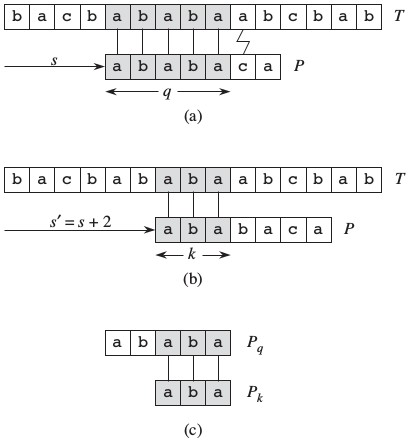

<script type="text/javascript" src="https://cdn.mathjax.org/mathjax/latest/MathJax.js?config=default"></script>

朴素字符串匹配时间复杂度为\\(O(n+m)\\)，其中n是文本长度，m是模式长度。Knuth、Morris、Pratt提出一种线性时间字符串匹配算法，利用已匹配信息，减少不必要的匹配，预处理时间为\\(O(m)\\), 匹配时间为\\(O(n)\\)。KMP实现方式有两种，本文线详细讲解《算法导论》上的实现，后面简述另一种实现。

# 一、前缀函数
前缀函数减少朴素算法中无效的尝试，下图(a)，模式\\(P[0...q-1]\\)和文本\\(T[s...s+q-1]\\)匹配，即位移s已匹配p个字符，第六p+1个字符a和c不匹配,那么则下一个**可能有效**的位移是\\({s}'=s+2\\)(图b)。



下一个位移为满足下式的最小\\({s}'\\):

$$P[0...k-1]=T[{s}'...{s}'+k-1]$$

其中\\({s}'+k-1=s+q-1\\)(若不相等，那么肯定是无效的位移)，由此可知\\(P[0...k-1]\\)是\\(P[0...q-1]\\)的**后缀**(图c)。后缀函数形式化表示如下：

$$suffix[q-1]=max \{ k:k<q \wedge  P[0...k-1]是P[0...q-1]的后缀 \}$$

KMP算法预先计算这些位移信息(下表)，匹配时候**节省无效位移和匹配有效位移中已匹配的k个字符时间**。

<table>
<tr>
    <td>i</td><td>0</td><td>1</td><td>2</td><td>3</td><td>4</td><td>5</td><td>6</td>
</tr>
<tr>
    <td>P[i]</td><td>a</td><td>b</td><td>a</td><td>b</td><td>a</td><td>c</td><td>a</td>
</tr>
<tr>
    <td>suffix[i]</td><td>-1</td><td>-1</td><td>0</td><td>1</td><td>2</td><td>-1</td><td>0</td>
</tr>
</table>

# 二、代码实现

## 2.1 计算后缀函数

1. 朴素算法——忽略
2. 利用前面计算的信息:**如果\\(suffix[k - 1] = j\\)， 那么\\(P[0...j] = P[k - 1 - j...k - 1]\\)**
    1. 如果 \\((P[k] == P[j + 1])\\)，即\\(P[0...j + 1] = p[k - 1 - j...k]\\)，也就是\\(suffix[k] = suffix[k - 1] + 1 = j + 1\\)。
    2. 否则做如下处理：

        ```cpp
        pre = j;
        do {
            pre = suffix[pre];
        } while (pre > 0 && P[pre + 1] != P[k])
        suffix[i] = pre + 1;
        ```

<a name="suffix">解释如下</a>：

1. 根据后缀函数的定义：\\(P[0...pre] = P[pre1 - pre...pre1] = ... = P[k - 1 - pre...k - 1]\\)。
2. 由\\(P[pre + 1] = P[k]\\)依次推出以下结论：
   1. \\(P[0...pre + 1] = P[k - 1 - pre...k]\\)
   2. \\(suffix[k] = pre + 1\\)。

综上所述，实现代码如下：

```cpp
void getSuffix() {
    suffix[0] = -1;
    for (int i = 1; i < m; ++i) {
        int pre = suffix[i - 1];
        while (pre >= 0 && P[pre + 1] != P[i]) {
            pre = suffix[pre];
        }
        if (P[pre + 1] == P[i]) suffix[i] = pre + 1;
        else suffix[i] = -1;
    }
}
```

## 2.2 匹配主程序

1. 模式和文本相等，那么同时向前移位
2. 如果模式下标为0，即第一个字符就不匹配，文本下标移动
3. 其他情况根据后缀函数匹配为匹配的字符

```cpp
int KMP() {
    int tidx, pidx;
    for(tidx = 0, pidx = 0; tidx < n && pidx < m; ) {
        if (T[tidx] == P[pidx]) {
            ++tidx, ++pidx;
        } else if (pidx == 0) {
            ++tidx;
        } else {
            pidx = suffix[pidx - 1] + 1;
        }
    }
    if (pidx == m) return tidx - m + 1;
    else return -1;
}
```

# 三、next数组实现方式
next数组表示当前字符匹配失败时需要回溯的位置：**next[j]表示P[0...j-1]中前缀和后缀相等的最大长度**。

    i       0   1   2   3   4   5   6   7   8   9
    ==============================================
    P[i]    a   b   a   b   a   b   a   b   c   a
    next[i] -1  0   0   1   2   3   4   5   6   0

在匹配ababa失败时候，易知最后一个a前面的ab匹配成功，那么可根据next数组直接匹配P[2]。

**next数组求法如下，原理类似[求解后缀函数](#suffix)**：

```cpp
void getNext() {
    next[0] = -1, next[1] = 0;
    int i = 1, j = 0;
    while(i < m) {
        if(j == -1 || P[j] == P[i]) {
            ++i, ++j;
            next[i] = j;
        }
        else j = next[j];
    }
}
```

**匹配过程**

```cpp
int KMP() {
    int i = 0, j = 0;
    while(i < n && j != m) {
        if(j == -1 || T[i] == P[j]) {
            ++i;++j;
        }
        else j = next[j];
    }
    if(j == m) return i - m + 1;
    else return -1;
}
```

# 其他
OJ题目：

[HDOJ1171](http://acm.hdu.edu.cn/showproblem.php?pid=1711)

参考资料：

1. 算法导论
2. [从头到尾彻底理解KMP](http://blog.csdn.net/v_JULY_v/article/details/7041827)
